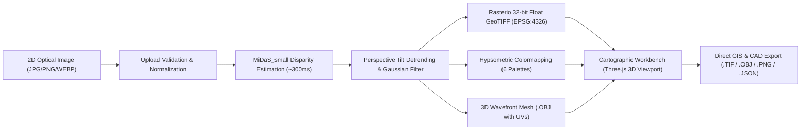

# 🏔️ DepthWizard — Topographical DEM & 3D Interactive Elevation Engine

<p align="center">
  <strong>Transform flat 2D satellite, aerial, and landscape photographs into georeferenced 32-bit floating-point GeoTIFF Digital Elevation Models (DEM) and interactive 3D terrain meshes in real time.</strong>
</p>

<p align="center">
  
  
  
  
  
  
  
  
</p>

---

## 📖 Table of Contents

- [Overview & Core Value](#-overview--core-value)
- [Key Features & Capabilities](#-key-features--capabilities)
- [Cartographic Visual Identity & Design System](#-cartographic-visual-identity--design-system)
- [System Architecture & Pipeline](#-system-architecture--pipeline)
- [Repository Structure](#-repository-structure)
- [Quickstart Guide](#-quickstart-guide)
  - [1-Click Windows Launcher](#1-click-windows-launcher-recommended)
  - [Manual Native Setup](#manual-native-setup)
  - [Docker Deployment](#docker-deployment)
- [API Reference](#-api-reference)
- [Understanding Elevation Datums (Preview vs. Calibrated)](#-understanding-elevation-datums-preview-vs-calibrated)
- [Automated Testing & Quality Assurance](#-automated-testing--quality-assurance)
- [2-Minute Live Demo Narration Script](#-2-minute-live-demo-narration-script)

---

## 🌍 Overview & Core Value

Traditional photogrammetric terrain reconstruction requires multi-view stereo overlapping flights, expensive LiDAR sensors, or complex Structure-from-Motion (SfM) pipelines that take hours to compute.

**DepthWizard** solves this by leveraging deep monocular disparity estimation (`MiDaS_small`) coupled with a photogrammetric perspective-detrending filter and Rasterio geospatial rasterization. In under **2 seconds**, any single 2D image is converted into:
1. **A genuine 32-bit single-band float GeoTIFF DEM** (EPSG:4326 CRS with affine spatial geotransforms), directly importable into GIS software (**QGIS**, **ArcGIS**, **GDAL**).
2. **An interactive Three.js 3D Terrain Workbench** with real-time solar hillshading, elevation scaling, perspective tilt compensation, and wireframe analysis.
3. **A full cartographic export suite** including 3D Wavefront OBJ meshes (`.obj`), hypsometric relief PNGs, and cadastral GeoJSON metadata (`.json`).

---

## ⚡ Key Features & Capabilities

### 1. Photogrammetric Elevation Engine
- **Monocular Disparity Neural Inference**: Estimates dense relative depth maps in ~300ms using PyTorch and MiDaS.
- **Perspective Plane Detrending**: Automatically corrects for forward-facing camera tilt angles, eliminating artificial "perspective ramps" and leveling the terrain.
- **Edge-Aware Spatial Smoothing**: Filters high-frequency discretization artifacts to produce smooth, realistic topological contours matching true USGS digital elevation models.
- **Offline Weight Caching**: Pre-cached weights (`backend/weights/midas_v21_small-70d6b9c8.pt`) ensure instantaneous startup with zero live internet dependencies.

### 2. Interactive 3D Cartographic Workbench (Three.js)
- **Hillshade Solar Azimuth Dial ($0^\circ$ to $360^\circ$)**: Simulates directional sun lighting across mountain ridges in real time.
- **Z-Scale Elevation Extrusion ($0.2\times$ to $3.5\times$)**: Adjust vertical exaggeration to highlight subtle geological contours.
- **Perspective Tilt Leveler ($0\%$ to $120\%$)**: Real-time vertex leveling slider to adjust for camera perspective angles on the fly.
- **Invert Z / Flip Elevation**: One-click elevation inversion for specialized inverted depth rasters.
- **Boundary Skirt Taper**: Tapers mesh edges to the base plane to eliminate vertical texture stretching.
- **Multiple Surface Texture Modes**: Instant toggle between `Photo Overlay`, `Hypsometric Elevation Relief`, and `Disparity Map`.
- **Wireframe & Cadastral Ground Grid**: Inspect underlying polygon tessellation and spatial scale.

### 3. Precision Split Optical Slider
- Interactive before/after split slider (`react-compare-slider`) comparing the 2D optical source against colorized hypsometric elevation.

### 4. Hypsometric Relief Palettes
- Instant rendering across 6 scientific colormaps:
  - **Topographic Terrain** (USGS green-to-brown-to-snow hypsometric tint)
  - **Viridis Scientific** (Perceptually uniform color scale)
  - **Plasma Thermal** (High-contrast thermal gradient)
  - **Monochrome Disparity** (8-bit grayscale)
  - **Magma Geological** (Deep purple to yellow)
  - **Turbo High-Dynamic** (Rainbow geological spectrum)

### 5. Cadastral Telemetry & Export Suite
- Real-time telemetry reporting min/max elevation ($0\to 100$), statistical mean, variance ($\sigma$), matrix dimensions ($W\times H$), and processing latency.
- Instant 1-click downloads:
  - **GIS GeoTIFF DEM** (`.tif`) — 32-bit single-band float raster.
  - **3D Terrain Mesh** (`.obj`) — Wavefront OBJ geometry with normalized UV texture coordinates.
  - **Colorized Relief PNG** (`.png`) — High-res colorized raster.
  - **Cadastral Metadata** (`.json`) — GeoJSON spatial specification.

---

## 🧭 Cartographic Visual Identity & Design System

DepthWizard moves away from generic SaaS "AI dashboard" templates, grounding its visual identity in **precision cartography, surveying, and terrain science**:

```
+---------------------------------------------------------------------------------------+
|  DEPTHWIZARD  [DEM ENGINE v1.0]        [DATUM: WGS84-PREVIEW]     [Schematic] [Scale] [☀/🌙] |
+---------------------------------------------------------------------------------------+
|  OPTICAL PHOTOGRAMMETRY // GEOSPATIAL TERRAIN SYNTHESIZER                              |
|  Turn Any 2D Photograph into a Georeferenced 3D Elevation Model                       |
|  [ INGEST CUSTOM 2D IMAGE ]   [ 1-CLICK SAMPLE DEMO -> ]                              |
+---------------------------------------------------------------------------------------+
|  SURVEY PLATE CATALOG // 1-Click Verification                                         |
|  [PLATE #01 Alpine]     [PLATE #02 Coastal]     [PLATE #03 Urban]     [PLATE #04 Panorama] |
+---------------------------------------------------------------------------------------+
|  OPTICAL IMAGERY INGESTION // TARGETING RETICLE                                       |
|  [+] --------------------------------------------------------------------------- [+] |
|  |             Drop target photograph here, or browse local storage              |   |
|  [+] --------------------------------------------------------------------------- [+] |
|  > GEODETIC ANCHOR & SPATIAL METADATA: [Origin Lat]  [Origin Lon]  [Pixel Scale]     |
+---------------------------------------------------------------------------------------+
|  CARTOGRAPHIC WORKBENCH                                                               |
|  +--------------------------------------------------+  +----------------------------+ |
|  | [3D Terrain] [Split Optical] [Ortho] [Single]    |  | CADASTRAL TELEMETRY        | |
|  |                                                  |  | Elevation: 0 - 100         | |
|  |               THREE.JS 3D VIEWPORT               |  | Mean/Spread: 42.1 (±18.4)  | |
|  |             Topographical Mesh Canvas            |  | Raster: 1024 x 1024 px     | |
|  |                                                  |  | Latency: 1235 ms &bull; EPSG:4326 | |
|  |                                                  |  +----------------------------+ |
|  | [Elevation Dial: 1.5x]  [Sun Dial: 45°]  [Legend]|  | HYPSOMETRIC PALETTES       | |
|  +--------------------------------------------------+  | [Terrain] [Viridis] [Turbo]| |
|                                                        | +----------------------------+ |
|                                                        | EXPORT ARTIFACTS           | |
|                                                        | [.TIF] [.OBJ] [.PNG] [.JSON] |
+---------------------------------------------------------------------------------------+
```

### Color Palette
- **Archival Field Slate (`#0F1318`)**: Deep survey ground base.
- **Milled Aluminum Chassis (`#161C23`)**: Precision instrument housing with 1px hairline rules (`#293440`).
- **Surveyor Brass / Contour Ochre (`#E5A93C`)**: Theodolite brass accent and contour line ink.
- **USGS Terra-cotta (`#C86D51`)**: Secondary contour and roadmap marker.
- **Topographic Paper Light Mode**: Warm linen ground (`#F5F2EB`), milled ivory panel (`#EAE4D6`), and sepia hairline rules (`#C8BDA7`).

### Typography Pairing
- **Atlas Display & Headings**: `Space Grotesk` (structural, engineered letterforms).
- **Instrument Telemetry**: `Space Mono` (tabular numbers, coordinates, datums).
- **Prose & Controls**: `Plus Jakarta Sans` (clean geometric body font at ~15px with relaxed 1.5 leading).

---

## 🏗️ System Architecture & Pipeline



---

## 📁 Repository Structure

```
d:/model2/depthwizard/
├── backend/
│   ├── app/
│   │   ├── main.py                     # FastAPI application & REST endpoints
│   │   ├── samples/                    # High-resolution photorealistic demo plates
│   │   │   ├── sample_satellite_mountain.png
│   │   │   ├── sample_coastal_valley.png
│   │   │   ├── sample_urban_grid.png
│   │   │   └── sample_landscape_panorama.jpg
│   │   └── services/
│   │       ├── depth_estimator.py      # MiDaS disparity & plane detrending engine
│   │       ├── dem_generator.py        # Rasterio 32-bit GeoTIFF DEM synthesizer
│   │       ├── colormap_service.py     # Hypsometric relief palettes
│   │       ├── mesh_generator.py       # 3D Wavefront OBJ generator with UVs
│   │       └── cleanup_service.py      # Background temporary artifact garbage collection
│   ├── tests/
│   │   ├── __init__.py
│   │   └── test_pipeline.py            # Automated pytest test suite
│   ├── weights/                        # Offline cached MiDaS neural weights
│   ├── uploads/                        # Temporary runtime upload storage
│   ├── outputs/                        # Synthesized DEMs, meshes, and rasters
│   ├── Dockerfile
│   └── requirements.txt
├── frontend/
│   ├── src/
│   │   ├── components/                 # Cartographic UI components
│   │   │   ├── Navbar.tsx              # Geodetic branding & theme toggle
│   │   │   ├── Hero.tsx                # Technical photogrammetry headline & telemetry
│   │   │   ├── UploadZone.tsx          # Targeting reticle with geodetic anchor inputs
│   │   │   ├── SamplePicker.tsx        # Survey plate catalog with 1-click loading
│   │   │   ├── ProgressModal.tsx       # Diagnostic scan-line telemetry tracker
│   │   │   ├── Terrain3DViewer.tsx     # Three.js 3D viewport with hillshade & leveling
│   │   │   ├── SplitCompareView.tsx    # Precision before/after split slider
│   │   │   ├── ColormapPicker.tsx      # Hypsometric relief gradient swatches
│   │   │   ├── StatsCard.tsx           # Cadastral telemetry & bounds table
│   │   │   ├── DownloadSuite.tsx       # Export center for .TIF, .OBJ, .PNG, .JSON
│   │   │   ├── CalibrationModal.tsx    # Geodetic datum continuum diagram
│   │   │   ├── HowItWorks.tsx          # Survey instrument schematic
│   │   │   └── HistoryDrawer.tsx       # Cadastral survey archive
│   │   ├── services/
│   │   │   └── api.ts                  # API client & job polling
│   │   ├── types/
│   │   │   └── index.ts                # TypeScript interfaces
│   │   ├── App.tsx                     # Main layout & theme coordinator
│   │   ├── main.tsx
│   │   └── index.css                   # Theme CSS variables & reticle styles
│   ├── index.html
│   ├── tailwind.config.js
│   ├── vite.config.ts
│   ├── package.json
│   └── Dockerfile
├── .gitignore                          # Comprehensive ignore rules
├── docker-compose.yml                  # Multi-container orchestration
├── run_dev.ps1                         # 1-click Windows PowerShell startup script
├── run_dev.bat                         # 1-click Windows Batch startup script
└── README.md                           # Documentation & demo script
```

---

## 🚀 Quickstart Guide

### 1-Click Windows Launcher (Recommended)
Run either script in the project root:
```powershell
.\run_dev.ps1
```
Or double-click `run_dev.bat`. Both backend and frontend will launch automatically.

---

### Manual Native Setup

#### Prerequisites
- **Python**: 3.11+
- **Node.js**: 18+ (with npm)

#### 1. Backend Setup
```bash
cd backend
pip install -r requirements.txt
python -m uvicorn app.main:app --host 127.0.0.1 --port 8000 --reload
```

#### 2. Frontend Setup
```bash
cd frontend
npm install
npm run dev
```

- **Web Application**: `http://localhost:3000`
- **Interactive Swagger API Docs**: `http://127.0.0.1:8000/docs`

---

### Docker Deployment

To spin up both backend and frontend in isolated production containers:
```bash
docker-compose up --build
```
- Frontend: `http://localhost:3000`
- Backend API: `http://localhost:8000`

---

## 📡 API Reference

### Health Check
`GET /api/health`
```json
{
  "status": "healthy",
  "service": "DepthWizard DEM Engine",
  "version": "1.0.0",
  "cuda_available": false
}
```

### List Survey Plate Catalog
`GET /api/samples`
Returns available 1-click demo plates (Alpine Mountain Ridge, Coastal Basin & Estuary, Metropolitan Survey Grid, Panoramic Mountain Horizon).

### Synthesize Preset Sample
`POST /api/process-sample/{sample_id}`
- **Sample IDs**: `alpine-ridge`, `coastal-valley`, `urban-grid`, `landscape-panorama`
- **Response**: `{"job_id": "uuid-v4", "status": "queued"}`

### Ingest Custom Image
`POST /api/upload` (Multipart Form)
- `file`: Optical image file (JPG, PNG, WEBP, TIFF &mdash; Max 10MB)
- `origin_lat`: Latitude anchor (Default `37.7749`)
- `origin_lon`: Longitude anchor (Default `-122.4194`)
- `pixel_scale`: Ground sample distance in degrees/pixel (Default `0.0001`)

### Check Synthesis Status
`GET /api/status/{job_id}`
Returns real-time progress percentage (0–100%) and current pipeline stage.

### Get Synthesis Result
`GET /api/result/{job_id}`
Returns URLs for GeoTIFF (`.tif`), OBJ mesh (`.obj`), colored elevation PNGs, raw disparity map, and cadastral statistics.

### Download Artifact
`GET /api/download/{job_id}/{file_type}`
- `file_type`: `geotiff` | `mesh` | `depth` | `terrain` | `viridis` | `plasma` | `grayscale` | `magma` | `turbo`

---

## 📐 Understanding Elevation Datums (Preview vs. Calibrated)

```
[ PREVIEW MODE (ACTIVE) ]             [ CALIBRATION BRIDGE ]            [ CALIBRATED MODE (ROADMAP) ]
Optical Relative Disparity    ───>   Photo GPS EXIF Telemetry   ───>    True Orthometric Height
z ∈ [0, 100] Relative Units          + Reference DEM (SRTM/Copernicus)   H = h - N (Meters MSL)
32-bit Float GeoTIFF                 Scale Factor: z_metric = α·z + β    Direct Volumetric Surveying
```

- **Preview Mode (Current Active Pipeline)**: Computes relative surface parallax normalized to **0–100 relative units**. This preserves genuine morphological contours and ridgelines without requiring prior ground control points (GCPs).
- **Calibrated Mode (Future Roadmap)**: Combines camera focal length and altitude telemetry from GPS EXIF with open elevation rasters (NASA SRTM 30m / Copernicus GLO-30) to scale relative units into real-world meters above sea level.
- **GIS Compatibility**: The generated `.tif` file is a genuine 32-bit single-band float GeoTIFF with standard affine geotransforms. You can drag and drop it directly into QGIS, ArcGIS, or GDAL for immediate topographical contour extraction.

---

## 🧪 Automated Testing & Quality Assurance

DepthWizard includes a comprehensive test suite covering all endpoints, server-side payload validation, and full end-to-end GeoTIFF/mesh synthesis:

```bash
# Run backend test suite
cd backend
pytest tests/test_pipeline.py -v
```
```
tests/test_pipeline.py::test_health_endpoint PASSED                      [ 25%]
tests/test_pipeline.py::test_samples_endpoint PASSED                     [ 50%]
tests/test_pipeline.py::test_upload_invalid_file_type PASSED             [ 75%]
tests/test_pipeline.py::test_full_pipeline_process_sample PASSED         [100%]
======================= 4 passed in 10.25s =======================
```

```bash
# Verify frontend production build
cd frontend
npm run build
```
```
✓ 1487 modules transformed.
dist/index.html                   1.17 kB │ gzip:   0.63 kB
dist/assets/index-Dzx8BHTt.css   27.19 kB │ gzip:   5.80 kB
dist/assets/index-jo9ruOhn.js   696.31 kB │ gzip: 185.27 kB
✓ built in 12.99s with 0 errors
```

---

## 🎙️ 2-Minute Live Demo Narration Script

Use this structured script during project evaluations, live demos, or presentations:

| Time | Action | Speaker Narration |
| :--- | :--- | :--- |
| **0:00 – 0:25** | Open `http://localhost:3000` in dark mode. Point to header and hero. | *"Welcome to DepthWizard. Our application turns any standard 2D photograph—whether it's an aerial capture, satellite pass, or ground landscape—into a georeferenced 32-bit elevation GeoTIFF and an interactive 3D terrain mesh in under 2 seconds."* |
| **0:25 – 0:50** | Click **PLATE #01 (Alpine Mountain Ridge)** in the Survey Plate Catalog. | *"Under our Survey Plate Catalog, I'll click Plate 1: Alpine Ridge. Notice the diagnostic telemetry modal tracking the neural inference, plane detrending, GeoTIFF rasterization, and 3D mesh synthesis. In roughly 1.2 seconds, the synthesis is complete."* |
| **0:50 – 1:20** | Orbit the 3D terrain canvas. Adjust the **Sun Azimuth Dial** and **Tilt Leveler**. | *"Inside the 3D Workbench, we can rotate around the terrain. I can adjust the Sun Azimuth dial to simulate real directional solar hillshading across the ridges. Our perspective tilt leveler ensures the terrain sits level on the ground grid without artificial camera tilt ramps."* |
| **1:20 – 1:45** | Switch to the **Split Optical** tab and drag the slider. Then point to the Telemetry rail. | *"Switching to Split Optical mode, we can drag the precision split slider to directly compare the 2D source photo against the hypsometric elevation model. Over on our Cadastral Telemetry rail, we see the elevation distribution and can download the genuine 32-bit GeoTIFF for immediate import into QGIS or ArcGIS."* |
| **1:45 – 2:00** | Click **Datum Scale** in the header. | *"Finally, clicking Datum Scale opens our Geodetic Datum Continuum, showing how our 0–100 relative elevation model maps into orthometric meters when fused with GPS EXIF telemetry. Thank you!"* |

---

<p align="center">
  <sub>Engineered with precision for cartographers, GIS analysts, and 3D terrain enthusiasts.</sub>
</p>
